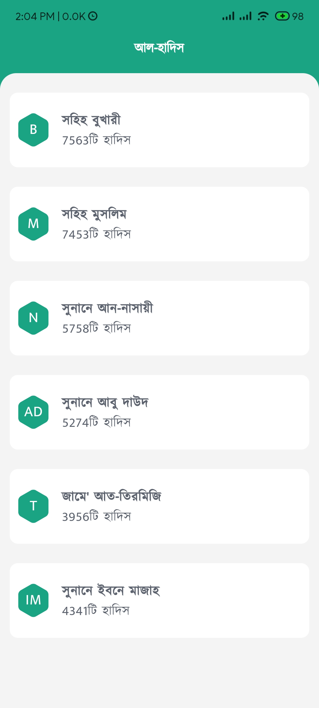
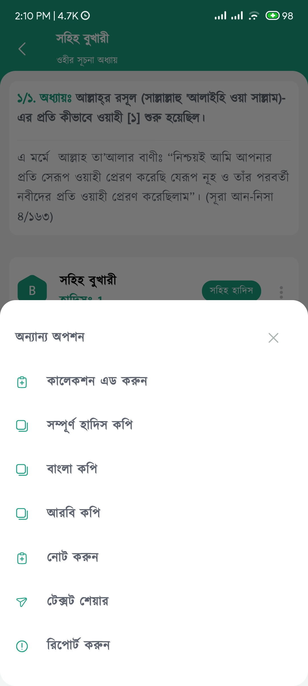

## Flutter Al Hadith App (Bangla)
The Bangla Hadith App is a mobile application designed to provide a convenient platform for users to access and explore a collection of authentic Hadiths in the Bengali language.This app is a skill test by IRD Foundation.

IRD Foundation is providing Islamic apps for the benefit of Mankind, expecting rewards from Allah Subhanawa ta'ala alone and following the Madhab & Manhaz of Salaf-e-Salehin.

This repository contains the source code for the app.

## Key Features
- **Authentic Hadith Collection:** Carefully curated Hadiths sourced from well-known compilations, presented in Bengali.
- **Search and Navigation:** Intuitive search and navigation features for easy exploration.
- **Daily Hadith:** Delivering a daily Hadith to users for regular engagement.
- **Save Hadith:** Personalized user accounts for bookmarking, history tracking, and preferences.
- **Audio Hadiths:** Integration of audio book for enhanced accessibility will be added.

## Database Analysis
I have analyzed their database and also created a demo database for demonstration purposes and code sharing. Here is my report.
If you are from IRF Foundation, please replace hadith.db with original database which located at "assest/database/" directory. Then build the app or check out relase version for the task. 
Thank you.

[DatabaseSchema.pdf](demo/db.pdf)

[](https://github.com/arrahmanbd/flutter_alhadith_bangla/releases/download/alpha/app-release.apk)

## Getting Started
**Clone the Repository:**
   ```bash
   git clone https://github.com/arrahmanbd/flutter_alhadith_bangla.git
```

## Packages

Packages I used in this project 

```bash
  drift: ^2.13.0
  sqlite3_flutter_libs: ^0.5.0
  path_provider: ^2.0.0
  path: ^1.8.3
  flutter_riverpod: ^2.4.9
  flutter_screenutil: ^5.9.0
  flutter_svg: ^2.0.9
  flutter_svg_provider: ^1.0.6
  flutter_native_splash: ^2.3.8
```
Using on dev dependency:

```bash
  drift_dev: ^2.13.0
  build_runner: ^2.4.6
```


## How to Rebuild
To regenarate the models simply run those commands below.

Re-generating drift Code:

```bash
  dart run build_runner build -d  
```
Re-generating Native splash:

```bash
  dart run flutter_native_splash:create  
```

## Run Project

To test this project Run this command:

```bash
  flutter run 
```
## Screenshots






## 🚀  Follow
[](https://arrahmanbd.github.io/)
[](https://www.linkedin.com/in/arrahmanbd)
[](https://www.github.com/arrahmanbd)


## Badges


[](https://choosealicense.com/licenses/mit/)
[](https://opensource.org/licenses/)
[](http://www.gnu.org/licenses/agpl-3.0)

